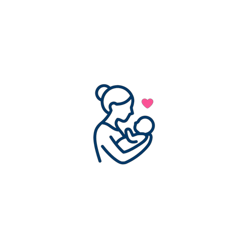

# RashMum UK — You're Not Alone, Mum. 💛

<p align="center">
  
</p>

<p align="center">
  <strong>A volunteer-led community for mums who need a village. No judgement, just mums who get it.</strong><br>
  Live PWA: <a href="https://clever-palmier-b0fb38.netlify.app">https://clever-palmier-b0fb38.netlify.app</a>
</p>

<p align="center">
  
  
  
  
</p>

---

### ✨ What is RashMum UK?

RashMum UK is a **Community Interest Company (CIC)** — run by mums, for mums. We exist because motherhood shouldn't feel lonely.

We started as 3 exhausted mums in a WhatsApp group at 3am. Now we're **10,000+ strong** across 50+ UK cities: London, Manchester, Birmingham, Leeds, Bristol and beyond.

We are not professionals with clipboards. We are mums in the trenches — the ones who've done the 3am feeds, the toddler tantrums, the return-to-work tears.

### 💞 What we offer

- **💬 Community Support** — 24/7 peer chat, no judgement, just genuine understanding
- **☕ Local Meetups** — Coffee mornings & park walks in 50+ UK cities
- **🌿 Mental Health** — Safe spaces for the hard bits, wellbeing tools
- **👩‍⚕️ Expert Advice** — Midwives, health visitors and counsellors volunteering
- **📞 24/7 Helpline** — Volunteer mums day & night: 0800 123 4567
- **📚 Resources** — UK-specific guides on feeding, sleep, benefits

> 100% free, confidential, and GDPR-compliant. No spam, ever.

### 🚀 Tech Stack

This is a **Progressive Web App (PWA)** — installable, offline-ready.

- **Frontend:** HTML5, Tailwind CSS, Vanilla JS
- **PWA:** manifest.json + Service Worker (sw.js) - v2 with icon caching
- **Icons:** Custom heart-mum logo (#e91e8c) on white background - 192x192 & 512x512
- **Hosting:** Netlify (auto-deploy from GitHub)
- **Domain:** clever-palmier-b0fb38.netlify.app (rename to rashmum-uk.netlify.app available)

### 📲 Install as App

**Android:** Chrome → Menu ⋮ → Install app  
**iPhone:** Safari → Share → Add to Home Screen

Works offline after first load!

### 🛠️ Run Locally

```bash
git clone https://github.com/khaled1226/rashmum-uk.git
cd rashmum-uk
# Open index.html with Live Server or just double-click
```

Project structure:
```
/
├── index.html              # Main app (with logo header + SEO)
├── public/
│   ├── manifest.json       # PWA manifest (v2 - categories + maskable)
│   ├── sw.js               # Service Worker (caches icons + offline fallback)
│   └── icons/
│       ├── icon-192x192.png
│       └── icon-512x512.png
└── README.md
```

### 🤝 Contributing

RashMum is volunteer-led. Mums, devs, designers welcome!

- Report bugs in **Issues**
- Suggest features via **Discussions**
- Improve accessibility, add languages (Welsh, Urdu etc)

### 📄 License & Contact

- **Organization:** Volunteer-led Community Interest Company
- **Charity #:** 1192847
- **Email:** hello@rashmum.uk
- **Helpline:** 0800 123 4567 (24/7)
- **License:** MIT - Free to use, please keep credit 💛
- **GDPR:** 100% confidential

If you or baby are unsafe, call **999** or **Samaritans 116 123**.

---

<p align="center">Made with love for UK mums 💛<br>London • Manchester • Birmingham • Leeds • Bristol & 45+ more</p>
