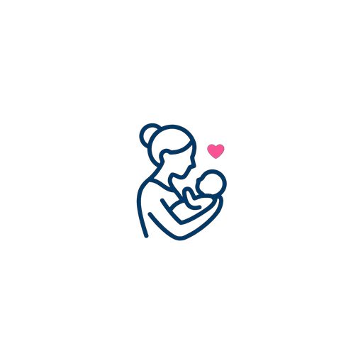

# RashMum UK — You're Not Alone, Mum. 💛

<p align="center">
  
</p>

<p align="center">
  <strong>A volunteer-led community for mums who need a village. No judgement, just mums who get it.</strong><br>
  <em>Now with a 24/7 AI support assistant, automated self-healing, and email auto-responses.</em>
</p>

<p align="center">
  
  
  
  
</p>

---

## ✨ What is RashMum UK?

RashMum UK is a **Community Interest Company (CIC)** — run by mums, for mums. We exist because motherhood shouldn't feel lonely.

We started as 3 exhausted mums in a WhatsApp group at 3am. Now we're **10,000+ strong** across 50+ UK cities.

> If you or baby are unsafe, call **999** or **Samaritans 116 123**.

## 🤖 The 24/7 Automation System

This rebuild adds a full automation layer on top of the community site:

| Feature | How it works |
|---|---|
| **🤖 24/7 AI support chat** | Gemini-powered assistant with a crisis-safe system prompt. If the AI is ever down (or the key is missing), a built-in knowledge base answers instantly — a mum **always** gets a reply. |
| **🟢 Keep the site online** | Convex cron health-checks the site + backend **every 5 minutes**, records live status to the database, and the landing page shows a real-time "All systems live 24/7" pill. Pair with free [UptimeRobot](https://uptimerobot.com) for external monitoring. |
| **🛠 Automate updates & fixes** | Health-check failures trigger automatic **self-heal cycles** (retry failed emails, verify recovery, alert humans). A GitHub Actions workflow (`.github/workflows/auto-fix.yml`) runs typecheck + build every 6 hours and opens an issue if anything breaks. |
| **✉️ Auto-respond to messages** | Every join/contact submission gets an instant branded confirmation email via **Resend**. Failed sends are retried automatically on the next health check, and the team gets a **daily 8am digest** of all activity. |

## 🚀 Tech Stack

- **Frontend:** React 18 + TypeScript + Vite + Tailwind CSS
- **Backend/Database:** Convex (reactive queries, actions, scheduled crons)
- **AI:** Google Gemini (`gemini-2.0-flash`) with knowledge-base fallback
- **Email:** Resend (transactional auto-replies + alerts + digests)
- **PWA:** installable, offline-ready (service worker v3, network-first)
- **Monitoring:** built-in cron health checks + GitHub Actions + optional UptimeRobot

## 🔑 Environment Variables

Set these in your hosting provider (and locally via `.env.local` / dashboard keys):

| Variable | Required | Purpose |
|---|---|---|
| `VITE_CONVEX_URL` | ✅ | Convex deployment URL — connects the frontend |
| `GEMINI_API_KEY` | optional | Enables real AI chat (without it, the knowledge base answers) |
| `RESEND_API_KEY` | optional | Enables emails (without it, submissions are stored + retried) |
| `ALERT_EMAIL` | optional | Where alerts & daily digests are sent |
| `SITE_URL` | optional | Public site URL for 5-minute health checks |
| `UPTIMEROBOT_API_KEY` | optional | External uptime monitoring |

**The app is fully functional with zero keys** — it degrades gracefully (knowledge-base chat, no emails) and recovers automatically once keys are added.

## 🛠️ Run Locally

```bash
bun install
bun convex dev --once   # deploy backend functions
bun run dev             # start frontend
```

Project structure:

```
/
├── index.html                  # App entrypoint
├── src/
│   ├── main.tsx                # React bootstrap
│   ├── App.tsx                 # Convex provider + layout
│   ├── components/             # LandingPage, JoinForm, ChatWidget
│   └── convex/                 # Backend
│       ├── schema.ts           # Database tables
│       ├── chat.ts             # AI chat action (Gemini + fallback)
│       ├── messages.ts         # Form submissions + auto-reply emails
│       ├── automation.ts       # Health checks, self-heal, digest, cleanup
│       ├── crons.ts            # 5-min health checks, daily digest, weekly cleanup
│       └── knowledge.ts        # Crisis-safe knowledge base
├── site-assets/                # PWA manifest, service worker, icons
├── docs/legacy-site/           # Original static site (archived)
└── .github/workflows/          # Auto-fix & health check workflow
```

## 📲 Install as App

**Android:** Chrome → Menu ⋮ → Install app
**iPhone:** Safari → Share → Add to Home Screen

Works offline after first load!

## 🤝 Contributing

RashMum is volunteer-led. Mums, devs, designers welcome!

- Report bugs in **Issues**
- Improve accessibility, add languages (Welsh, Urdu etc)

## 📄 License & Contact

- **Organization:** Volunteer-led Community Interest Company
- **Charity #:** 1192847
- **Email:** hello@rashmum.uk
- **Helpline:** 0800 123 4567 (24/7)
- **License:** MIT - Free to use, please keep credit 💛

---

<p align="center">Made with love for UK mums 💛<br>London • Manchester • Birmingham • Leeds • Bristol & 45+ more</p>
